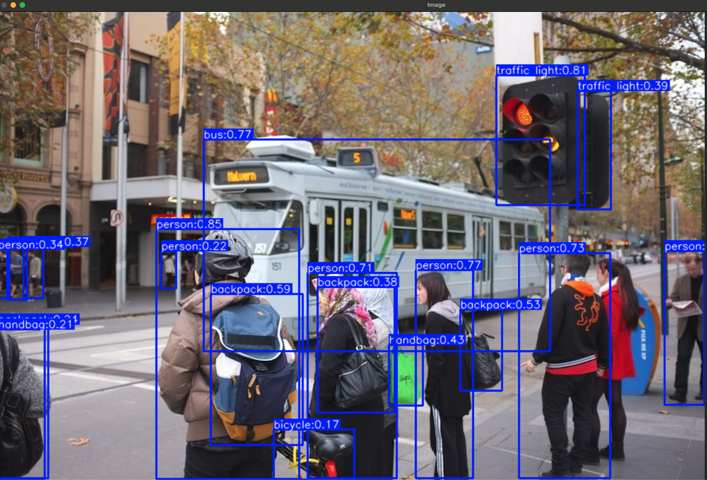
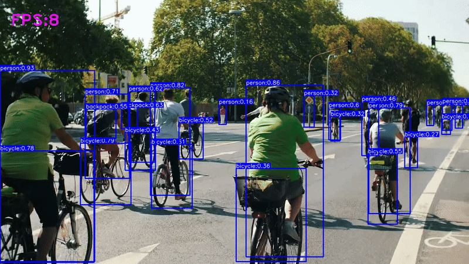

# YOLOv12 Custom Object Detection Script (using Ultralytics)

## Description

This Python script demonstrates real-time object detection on video files or webcam streams using a YOLO model via the `ultralytics` library and OpenCV (`cv2`). It processes video frames, identifies objects based on the COCO dataset, draws bounding boxes with class labels and confidence scores, calculates and displays the processing Frames Per Second (FPS), and saves the resulting video.

**Note on "YOLOv12":** The script loads a model named `yolo12n.pt`. As of this writing, "YOLOv12" is not an officially recognized version from the original YOLO authors or major research groups. This might be a custom-trained model, an unofficial variant, or potentially a naming convention specific to a certain project using the `ultralytics` framework (which commonly supports YOLOv5, YOLOv8, etc.). The underlying detection principles and usage with the `ultralytics` library remain consistent.

## Table of Contents

- [Features](#features)
- [Prerequisites](#prerequisites)
- [Installation](#installation)
- [Usage](#usage)
- [Code Explanation](#code-explanation)
  - [Imports](#imports)
  - [Video Input/Output Setup](#video-inputoutput-setup)
  - [Model Loading & Class Names](#model-loading--class-names)
  - [Processing Loop](#processing-loop)
  - [Object Detection](#object-detection)
  - [Processing Detections](#processing-detections)
  - [Drawing Bounding Boxes & Labels](#drawing-bounding-boxes--labels)
  - [FPS Calculation & Display](#fps-calculation--display)
  - [Output & Cleanup](#output--cleanup)
- [Configuration Parameters](#configuration-parameters)
- [Screenshots](#screenshots)
  - [Object Detection on Image Example](#object-detection-on-image-example)
  - [Object Detection on Video Example](#object-detection-on-video-example)

## Features

*   Real-time object detection on video files or live webcam feed.
*   Uses a pre-trained YOLO model (`yolo12n.pt`) loaded via the `ultralytics` library.
*   Detects objects from the 80 classes in the COCO dataset.
*   Draws bounding boxes around detected objects.
*   Displays class labels and confidence scores for each detection.
*   Calculates and overlays the processing FPS on the video.
*   Saves the processed video with annotations to an output file (`output.mp4`).
*   Configurable confidence threshold and Non-Maximum Suppression (NMS) IoU threshold.

## Prerequisites

*   Python 3.x
*   OpenCV library
*   Ultralytics library
*   A pre-trained YOLO model file compatible with Ultralytics (e.g., `yolo12n.pt` used in the script).
*   An input video file (e.g., `video.mp4`) or a connected webcam.

## Installation

1.  **Clone or download the script.**
2.  **Install required Python libraries:**
    ```bash
    pip install opencv-python ultralytics
    ```
3.  **Obtain the model file:** Make sure you have the `yolo12n.pt` model file (or your desired model) in the same directory as the script, or provide the correct path in the script.
4.  **Prepare input video:** Place your input video file (e.g., `video.mp4`) in a `Resources/Videos/` subdirectory relative to the script, or modify the path in the `cv2.VideoCapture()` line. Create the directories if they don't exist.

## Usage

1.  **Configure Input/Output:**
    *   Modify the `cv2.VideoCapture(...)` line to point to your video file or change to `0` for the default webcam.
    *   Modify the `cv2.VideoWriter(...)` line if you want to change the output filename (`output.mp4`).
2.  **Run the script:**
    ```bash
    python your_script_name.py
    ```
    (Replace `your_script_name.py` with the actual name of the Python file).
3.  **Viewing:** An OpenCV window titled "Video" will open, displaying the video stream with detected objects, bounding boxes, labels, and FPS.
4.  **Stopping:** Press the '1' key while the OpenCV window is active to stop the script.
5.  **Output:** The processed video will be saved as `output.mp4` (or the configured filename) in the same directory as the script upon completion or interruption.

## Code Explanation

### Imports

Imports necessary libraries:
*   `cv2`: OpenCV for video/image handling and drawing.
*   `math`: For rounding confidence scores (`math.ceil`).
*   `time`: For calculating FPS.
*   `ultralytics.YOLO`: The core class for loading and running the YOLO model.

### Video Input/Output Setup

*   `cv2.VideoCapture`: Opens the video source (file or webcam).
*   Gets video properties (width, height, original FPS).
*   `cv2.VideoWriter`: Configures the output video file (name, codec, FPS, frame size).

### Model Loading & Class Names

*   `model = YOLO("yolo12n.pt")`: Loads the specified YOLO model weights.
*   `cocoClassNames`: A list containing the names of the 80 COCO dataset classes, used to map predicted class IDs to human-readable names.

### Processing Loop

*   A `while True` loop reads frames from the video source one by one (`cap.read()`).
*   The loop continues as long as frames are successfully read (`ret` is True).

### Object Detection

*   `results = model.predict(frame, conf=0.15, iou=0.1)`: Performs object detection on the current `frame`.
    *   `conf=0.15`: Sets the confidence threshold. Only detections with a score >= 15% are kept.
    *   `iou=0.1`: Sets the IoU threshold for Non-Maximum Suppression (NMS). Lower values mean stricter suppression of overlapping boxes.

### Processing Detections

*   Iterates through the `results` and then through each detected `box`.
*   Extracts bounding box coordinates (`box.xyxy`), class ID (`box.cls`), and confidence score (`box.conf`).

### Drawing Bounding Boxes & Labels

*   Converts coordinates to integers.
*   `cv2.rectangle`: Draws the bounding box on the frame.
*   Looks up the class name using the class ID.
*   Formats the confidence score.
*   Creates a text label (`ClassName:Confidence`).
*   Calculates text size to draw a filled background rectangle for better readability.
*   `cv2.putText`: Draws the class name and confidence score above the bounding box.

### FPS Calculation & Display

*   Uses `time.time()` before and after processing to measure elapsed time per frame.
*   Calculates FPS = 1 / (elapsed time).
*   `cv2.putText`: Draws the calculated FPS on the top-left corner of the frame.

### Output & Cleanup

*   `output_video.write(frame)`: Writes the processed frame (with drawings) to the output video file.
*   `cv2.imshow("Video", frame)`: Displays the processed frame in a window.
*   `cv2.waitKey(1)`: Waits briefly for user input. If '1' is pressed, the loop breaks.
*   The loop also breaks if the video ends (`ret` is False).
*   `cap.release()`: Releases the video input source.
*   `output_video.release()`: **Crucially finalizes and saves the output video file.** (Ensure this line is present in your code before `cv2.destroyAllWindows()`).
*   `cv2.destroyAllWindows()`: Closes the OpenCV display window.

## Configuration Parameters

You can easily modify these parameters in the script:

*   `cap = cv2.VideoCapture("Resources/Videos/video.mp4")`: Change the path to your video or use `0` for webcam.
*   `output_video = cv2.VideoWriter('output.mp4', ...)`: Change `'output.mp4'` to your desired output filename.
*   `model = YOLO("yolo12n.pt")`: Change `"yolo12n.pt"` to the path of your model file.
*   `conf=0.15`: Adjust the confidence threshold (0.0 to 1.0). Higher values mean fewer, but likely more accurate, detections.
*   `iou=0.1`: Adjust the NMS IoU threshold (0.0 to 1.0). Higher values allow more overlapping boxes.

## Screenshots

*(Replace the placeholder links/text below with actual screenshots)*

### Object Detection on Image Example


*Caption: Example of object detection results on a single image frame.*

### Object Detection on Video Example


*Caption: Example frame from the processed output video showing detected objects, labels, and FPS.*